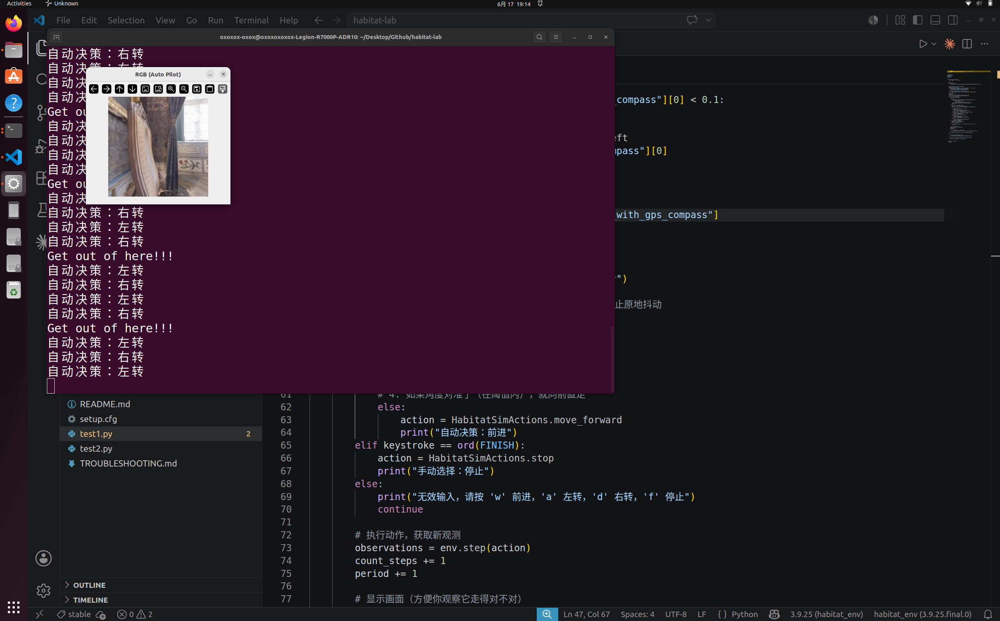
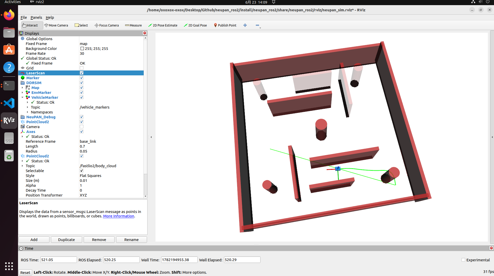

### Week 2 - 2026-06-15

**Attend this week's meeting:** Yes

**Progress this week**

- 1. succesfully install Ubuntu 22.04 system on SSD and install drive for the nvidia.

- 2. install ROS2 environment

- 3. Run the smoke test for NeuPAN


And know the basic structure of the repo pf NeuPAN

- 4. Choose Habitat and install both sim and lab

- 5. Successful run the smoke test of Habitat



The source code I run is listed below:

```python
import habitat
from habitat.sims.habitat_simulator.actions import HabitatSimActions
import cv2


FORWARD_KEY="w"
LEFT_KEY="a"
RIGHT_KEY="d"
FINISH="f"


def transform_rgb_bgr(image):
    return image[:, :, [2, 1, 0]]


def example():
    env = habitat.Env(
        config=habitat.get_config("benchmark/nav/pointnav/pointnav_habitat_test.yaml")
    )

    print("Environment creation successful")
    observations = env.reset()
    print("Destination, distance: {:3f}, theta(radians): {:.2f}".format(
        observations["pointgoal_with_gps_compass"][0],
        observations["pointgoal_with_gps_compass"][1]))

    print("Agent stepping around inside environment.")
    cv2.imshow("RGB (Auto Pilot)", transform_rgb_bgr(observations["rgb"]))

    count_steps = 0
    period = 1
    dis = observations["pointgoal_with_gps_compass"][0]
    # 获取当前观测
    while not env.episode_over:
        keystroke = cv2.waitKey(0)

        if period == 5:
            if dis - observations["pointgoal_with_gps_compass"][0] < 0.1:
                print("Get out of here!!!")
                for _ in range(3):
                    action = HabitatSimActions.turn_left
            dis = observations["pointgoal_with_gps_compass"][0]
            period = 1

        if keystroke == ord(FORWARD_KEY):
            # 解析传感器数据：[距离, 角度（弧度）]
            distance, theta = observations["pointgoal_with_gps_compass"]
            
            # 1. 判定是否到达终点（距离 < 0.2 米）
            if distance < 0.2:
                action = HabitatSimActions.stop
                print(f"到达目标点！共走 {count_steps} 步")
            # 2. 如果目标在右侧（角度为正），右转
            elif theta > 0.1:  # 0.1 弧度约为 5.7 度，防止原地抖动
                action = HabitatSimActions.turn_right
                print("自动决策：右转")
            # 3. 如果目标在左侧（角度为负），左转
            elif theta < -0.1:
                action = HabitatSimActions.turn_left
                print("自动决策：左转")
            # 4. 如果角度对准了（在阈值内），就向前直走
            else:
                action = HabitatSimActions.move_forward
                print("自动决策：前进")
        elif keystroke == ord(FINISH):
            action = HabitatSimActions.stop
            print("手动选择：停止")
        else:
            print("无效输入，请按 'w' 前进，'a' 左转，'d' 右转，'f' 停止")
            continue

        # 执行动作，获取新观测
        observations = env.step(action)
        count_steps += 1
        period += 1

        # 显示画面
        cv2.imshow("RGB (Auto Pilot)", transform_rgb_bgr(observations["rgb"]))

    print("Episode finished after {} steps.".format(count_steps))

    if (
        action == HabitatSimActions.stop
        and observations["pointgoal_with_gps_compass"][0] < 0.2
    ):
        print("you successfully navigated to destination point")
    else:
        print("your navigation was unsuccessful")


if __name__ == "__main__":
    example()
```

- 6. reproducing the first experiment in NeuPAN, and get the result.

- 7. Build the ros2 pkg for neupan and use it to start gazebo simulator (image below are for rviz)




**Challenges & blockers**

- confuse about using habitat or not

- Not sure which reinforce learning algorithm is suitable for navigation


**Next steps**

- ask teacher for some guidance on how to further finish our research

- Build gazebo in detail to totally reproduce the result of NeuPAN