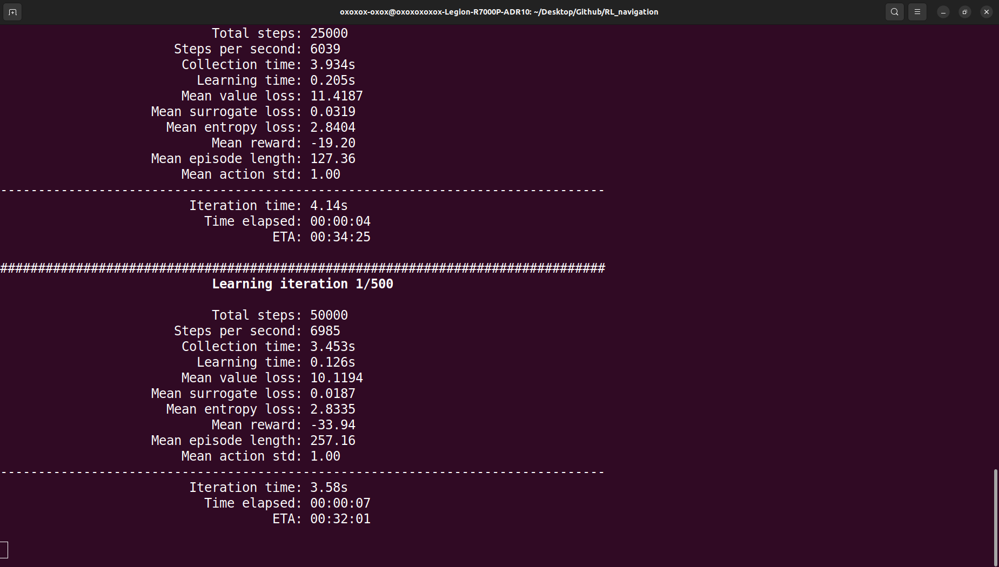
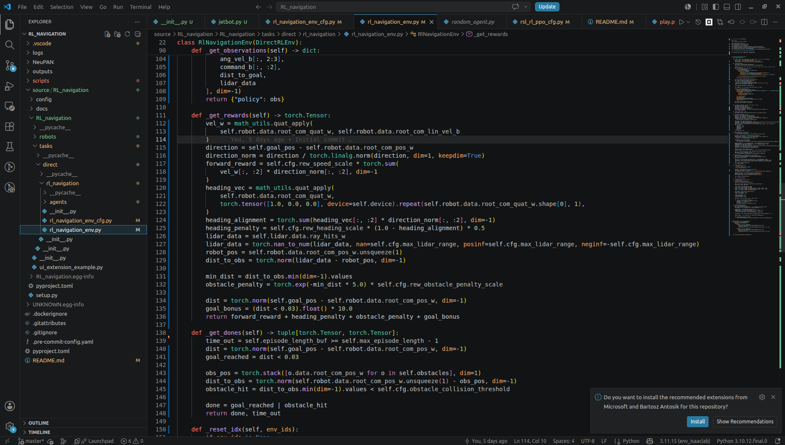
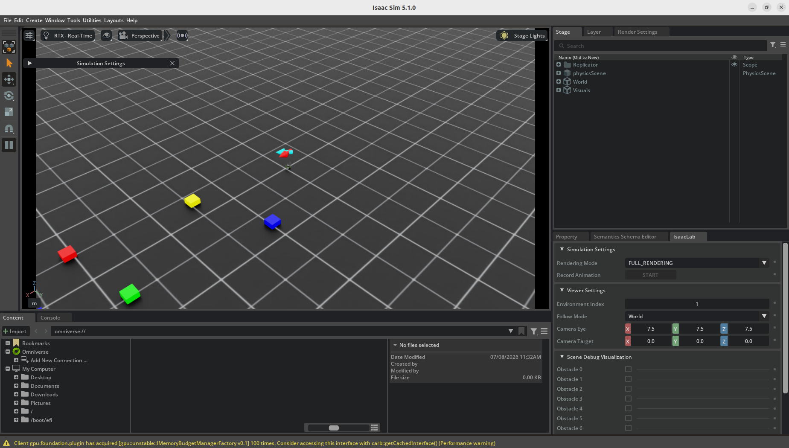

# Week 3 - 2026-06-30

**Attended this week's meeting:** Yes

**Progress this week**

- Get used to Isaacsim and Isaaclab, using Isaaclab to train RL algorithm that can be employed on the turtlenot3

- Completely understand the structure of NeuPAN, and plan to solving the problems of latency while it is navigation

- Set up lidar and obstacles for the training of RL in isaaclab

- build the turtlebot3 that can run navigatoin code on it.

- Write ros2 project that can using launch.py to open rviz in OrangePi and can navigation once receive the target

**Challenges & blockers**

- The pt didn't perform well, for it didn't learn all the reward function as I exepected

- The draft of our team's final research direction is still a little confuse, need to be confirmed further

- Need to fully understand how the latency was applied to the network will robot is navigation

**Next steps**

- get more familiar with ir-sim(for neupan) and isaaclab(for rl)

- Confirm if our direction is suitable for further study

- train RL more time to make sure how to make the robot perform better

- Fully understand the principle of ROS2 Correspond in turtlebot3

- Read more essay to get ideas

**Hours spent (optional):**

**Links (optional):**
